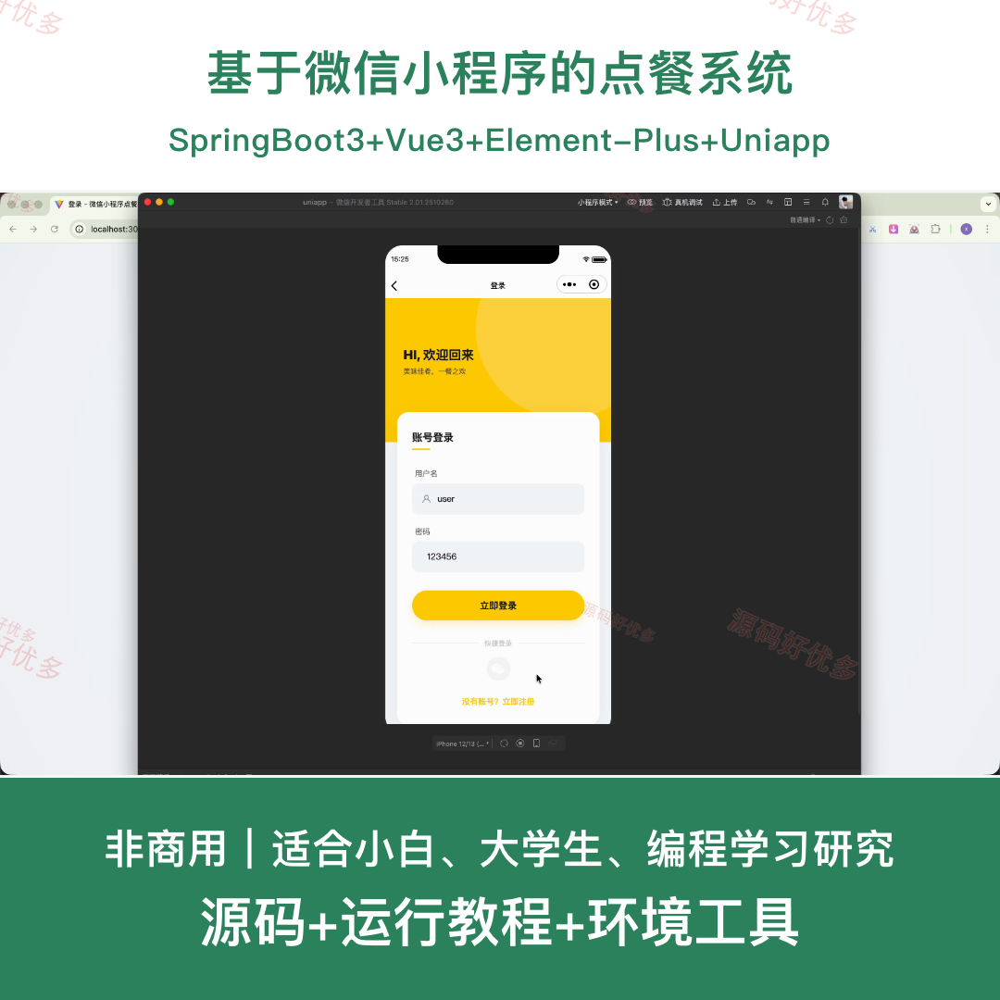
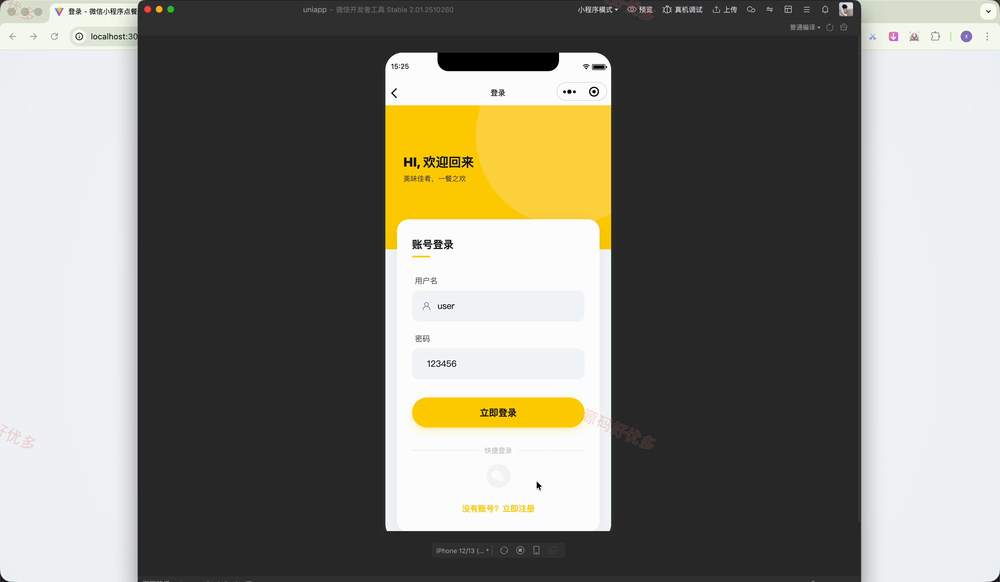
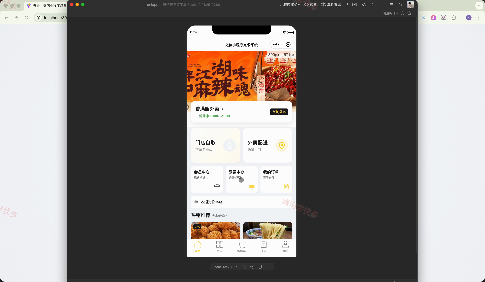
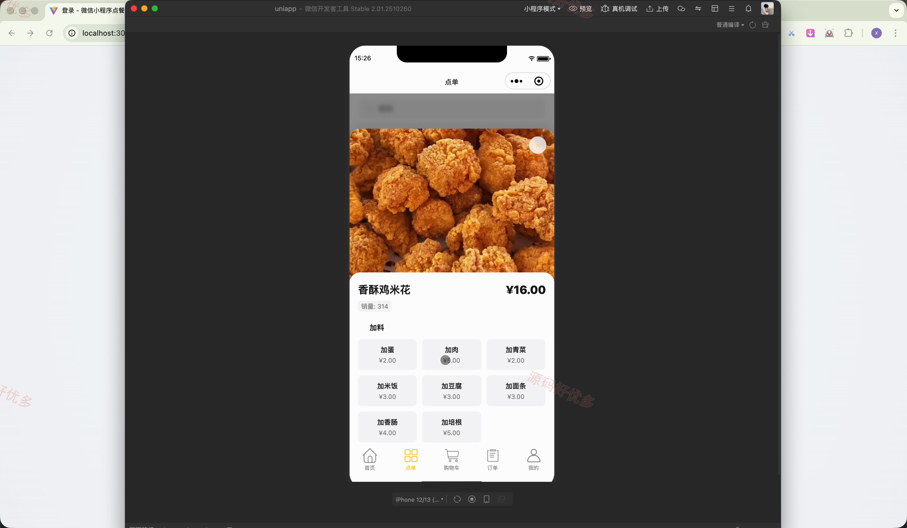
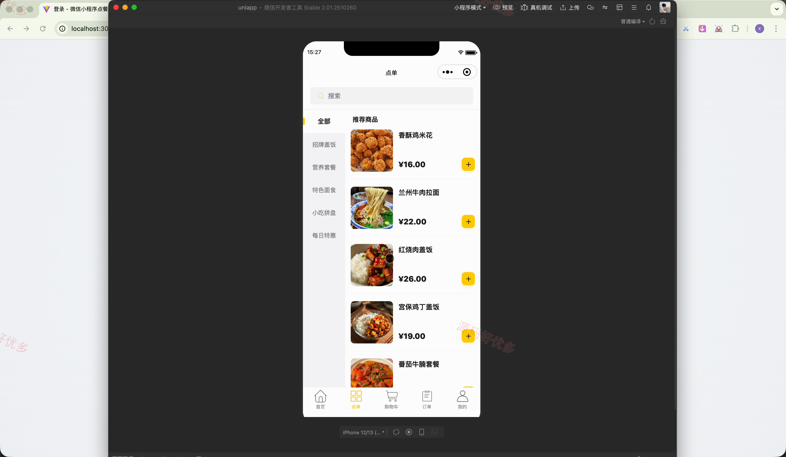
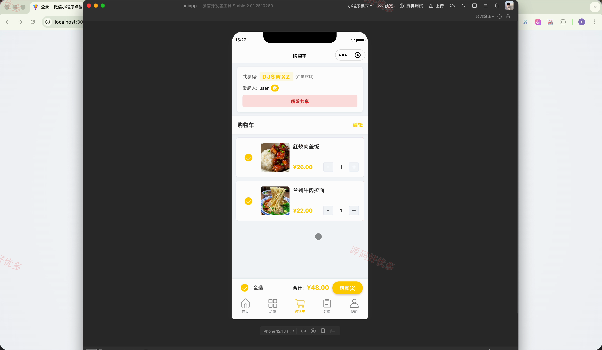
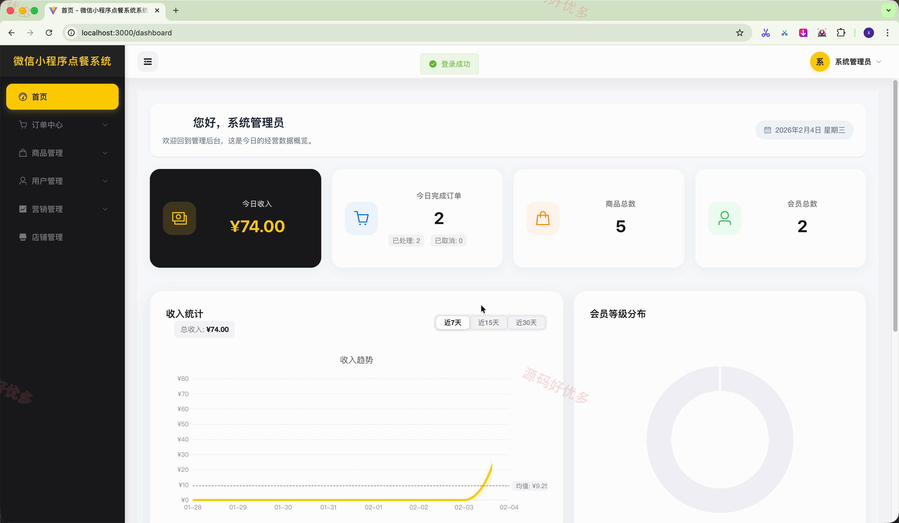
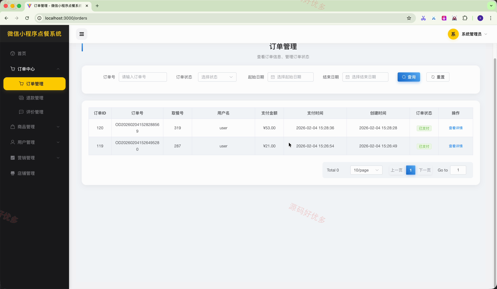
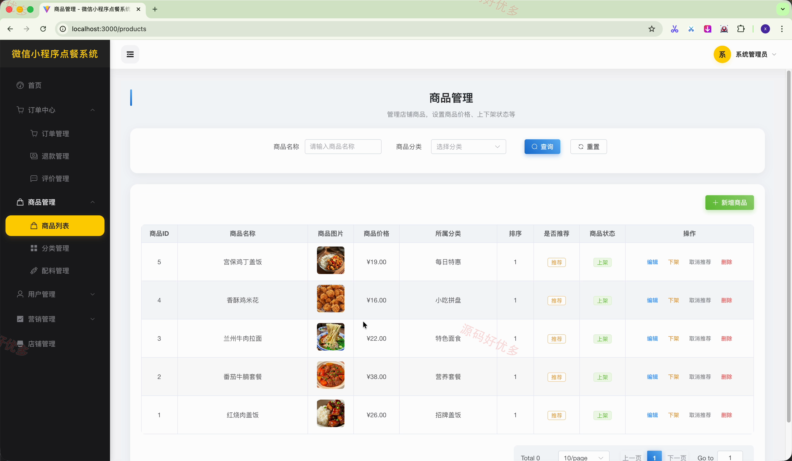

## 源码问题查看主页咨询

### 一、关键词
微信小程序点餐、菜品管理、购物车、订单管理、会员营销

### 二、作品包含
源码+数据库+全套环境和工具资源+本地部署教程

### 三、项目技术
前端技术： Html、Css、Js、Vue3.5、Element-Plus、uniapp
后端技术：Java、SpringBoot3.4.4

### 四、运行环境（以下版本亲测，其他版本兼容性请自行测试）
开发工具：IDEA/eclipse + VSCODE + HBuilder X + 微信开发者工具

数据库：MySQL8.0+（共22张表）

数据库管理工具：Navicat10以上版本

环境配置软件： JDK17 + Maven3.6.3

前端Nodejs：16+

浏览器：谷歌浏览器

### 五、项目介绍
项目编号：mpweixinA276D

基于微信小程序的点餐系统面向用户和管理员，串联菜品浏览、共享购物车、下单支付、优惠会员与门店运营等业务，实现小程序点餐和后台管理协同。

角色：用户、管理员

用户功能：菜品浏览与搜索、规格选择与购物车管理、共享购物车拼单、堂食或配送下单与支付、订单全流程处理、收货地址管理、优惠券与会员权益、每日签到与积分。

管理员功能：运营数据概览、用户与会员等级管理、菜品与配套信息管理、订单与退款处理、优惠券创建与发放、评价与公告管理、轮播图与店铺信息管理、积分规则与角色权限管理。

### 六、运行截图

